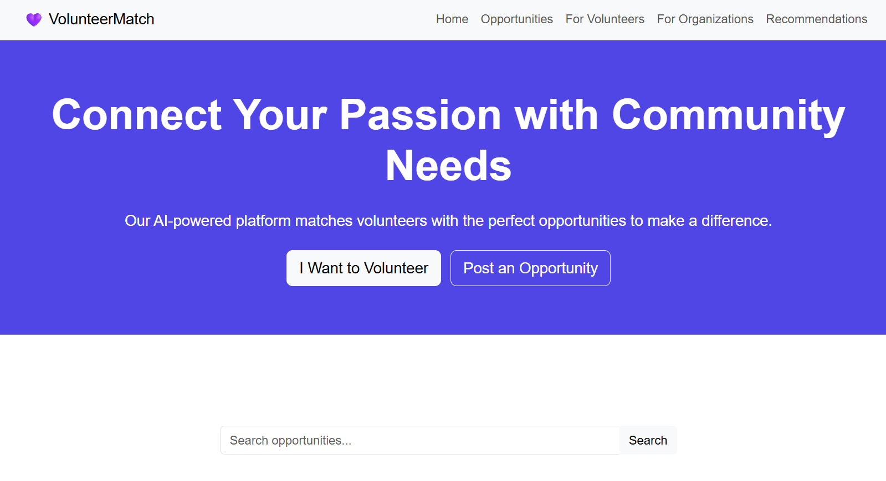
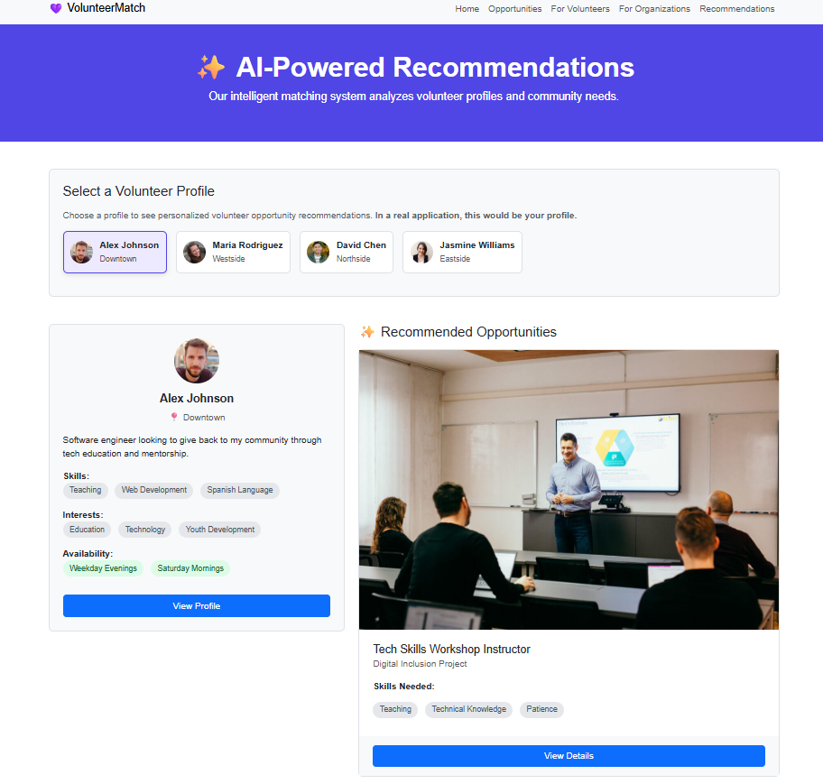
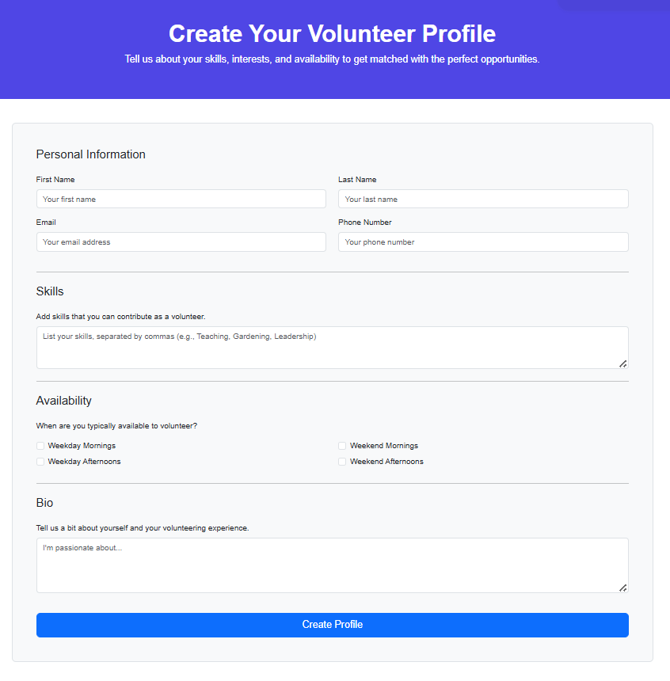
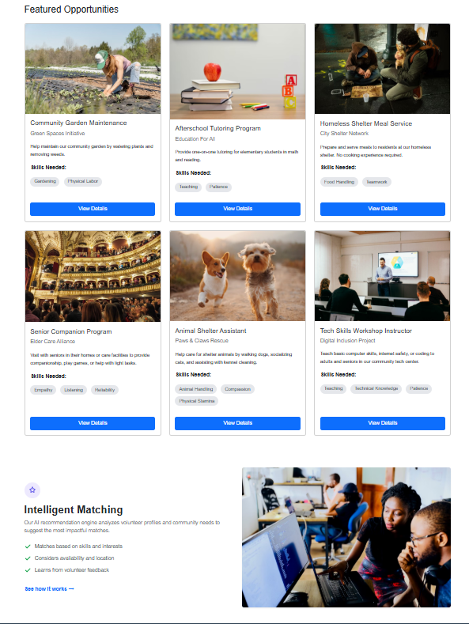

# The "Signal-Sense" Network Mapper (VolunteerMatch) 🤝

**🥉 3rd Place Winner - Hackathon 101 (CISCO Community VIT Bhopal)**

---

## 📖 Overview
This project is a high-fidelity frontend prototype built within a 36-hour timeframe for the Social Service domain of Hackathon 101. It is an intelligent, two-sided marketplace platform designed to seamlessly connect passionate volunteers with non-profit organizations and local community needs.

*Note: To meet the rapid deployment constraints of the hackathon, this repository currently focuses entirely on the Frontend UI/UX architecture and simulates the core recommendation logic using client-side JavaScript. There is no active backend database.*

---

## 📸 Platform Previews

  
  &nbsp;
  

  
  &nbsp;
  

---

## ✨ Key Features
* **Dual-Profile Architecture:** Separate, intuitive user journeys and interfaces for volunteers (skills, availability) and organizations (needs, locations).
* **Simulated AI Recommendation Engine:** An interactive matching page that uses JavaScript to simulate the core logic of matching volunteer profiles with the most relevant community opportunities in real-time.
* **Responsive UI/UX:** Fully responsive, multi-page layout built to function seamlessly across mobile, tablet, and desktop devices.
* **Dynamic Content Rendering:** JavaScript is utilized to dynamically populate opportunity cards and volunteer profiles across the platform.

---

## 💻 Tech Stack
* **HTML5** & **CSS3**
* **JavaScript (ES6)**
* **Bootstrap 5** (for rapid, responsive component styling)

---

## 🚀 How to Run Locally
This project has no complex dependencies, build steps, or backend server requirements. You can run it directly in your browser.

1. **Clone or Download the Repository:** Ensure you have the complete project folder containing all `.html`, `.css`, `.js` files, and the image assets.
2. **Open `index.html`:** Simply drag the `index.html` file into your web browser (like Chrome, Firefox, or Edge), or right-click it and choose "Open with..." and select your browser.
3. **Navigate the Platform:** The website will load, allowing you to click through the different user journeys and test the interactive recommendation features.

---

## 🔮 Future Scope (Backend Integration)
To evolve this prototype into a fully functional platform, the following backend architecture is planned:
* Integration of a NoSQL database (like MongoDB) to store volunteer and organizational data.
* Implementation of a Python/Flask or Node.js backend to handle API routing and authentication.
* Deployment of a true collaborative filtering or content-based AI recommendation model using Python.
